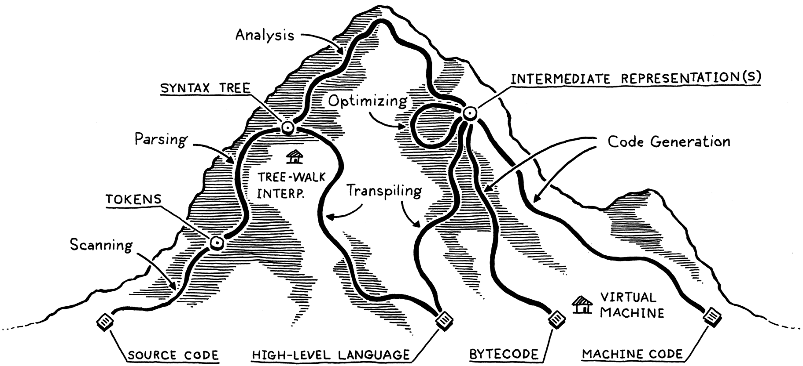
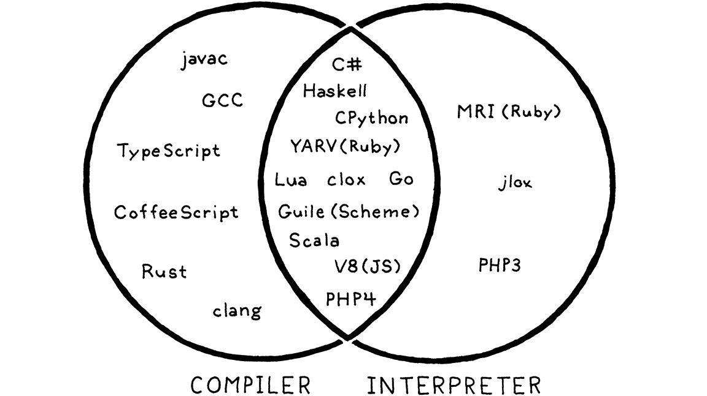

# LOX

## The map

Compiling is an implementation technique that involves translating a source language to some other—usually lower-level—form. When you generate bytecode or machine code, you are compiling. When you transpile to another high-level language, you are compiling too.

When we say a language implementation “is a compiler”, we mean it translates source code to some other form but doesn’t execute it. The user has to take the resulting output and run it themselves.

Conversely, when we say an implementation “is an interpreter”, we mean it takes in source code and executes it immediately. It runs programs “from source”.

**maximal munch**
