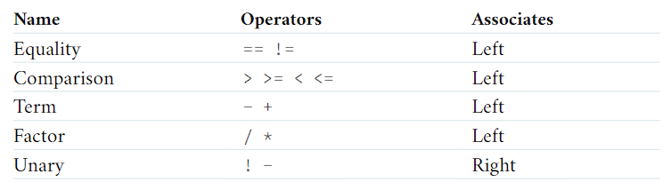
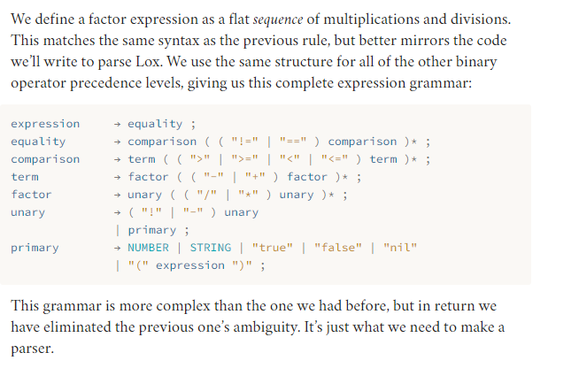
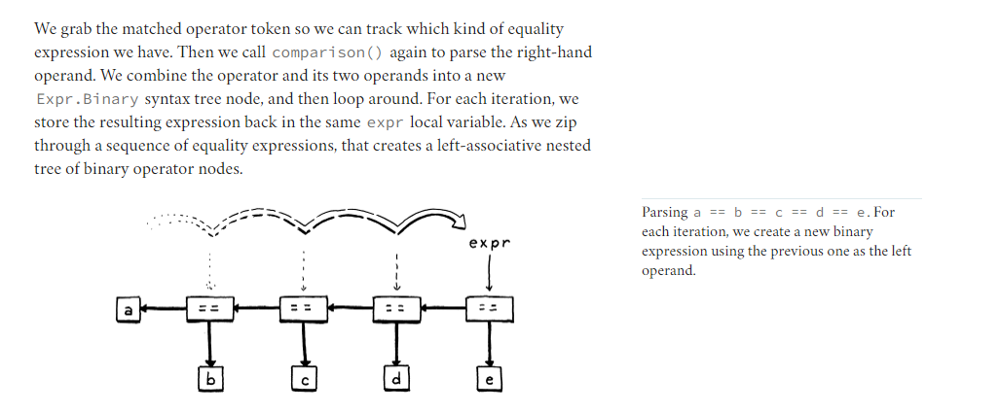

**Recursive descent** is considered a top-down parser because it starts from the top or outermost grammar rule (here expression) and works its way down into the nested subexpressions before finally reaching the leaves of the syntax tree. This is in contrast with bottom-up parsers like LR that start with primary expressions and compose them into larger and larger chunks of syntax.

